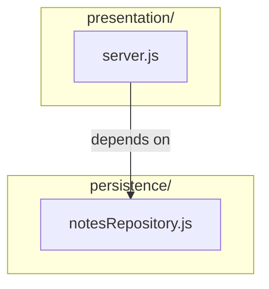
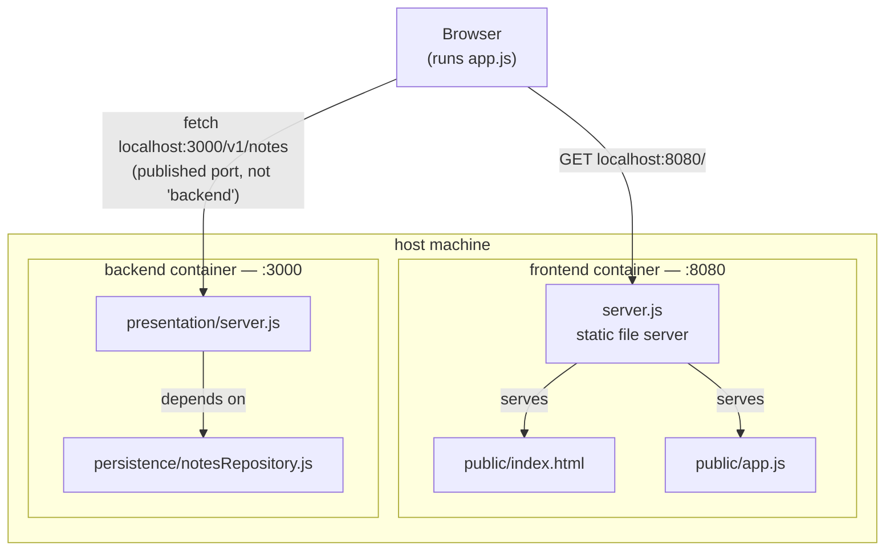

# notes-layered (Node.js) — the absolute minimum layered example

Stripped down further than the Kotlin and Python siblings in `../../08._layered_architecture/example-kotlin/`
and `../../08._layered_architecture/example-python/`: **two layers only** (presentation, persistence — no
application, no domain), **zero npm dependencies** (Node's built-in `http`
module, no Express), and **two separate Docker images** — a backend and a
frontend that reads from it. Use this one when you want the dependency-rule
story with nothing else competing for attention.

## Run it

From this folder:

```bash
docker compose up --build
```

Then open `http://10.136.138.88:8080` in a browser — the frontend fetches
`http://10.136.138.88:3000/v1/notes` from the backend and renders the contact list.

Or talk to the backend directly:

```bash
curl localhost:3000/v1/notes
curl localhost:3000/v1/notes/1
curl -X POST localhost:3000/v1/notes \
  -H 'Content-Type: application/json' \
  -d '{"title":"hello","body":"first note"}'
```

Stop with `Ctrl-C`, clean up with `docker compose down`.

## Backend endpoints

The backend listens on `http://localhost:3000`. Every response is JSON.

| Method | Path | Request body | Success | Errors |
|--------|------|--------------|---------|--------|
| `GET` | `/v1/notes` | — | `200` — array of contacts | `502` — data source unavailable |
| `GET` | `/v1/notes/{id}` | — | `200` — one contact | `404` — note not found; `502` — data source unavailable |
| `POST` | `/v1/notes` | `{"title":"...","body":"..."}` | `201` — data source response | `400` — invalid JSON or fields; `502` — data source unavailable |

The active repository returns contacts from an external test API. All response
fields are described in `swagger.json`. Any unknown method or path returns
`404` `{"error":"Not found"}`. Repository failures return
`502` `{"error":"Data source unavailable"}`.

## The two layers (backend)

```
backend/
└── src/
    ├── presentation/
    │   └── server.js        ← receives HTTP requests, renders JSON
    └── persistence/
        └── notesRepository.js  ← hardcoded data — see below
```

| Layer            | Depends on    | Knows nothing about |
|-------------------|---------------|----------------------|
| `presentation/`    | `persistence` | —                    |
| `persistence/`     | —             | `presentation`       |



Verify by running:

```bash
grep -rn "require(" backend/src
```

You'll find exactly one cross-layer import: `presentation/server.js` requiring
`../persistence/notesRepository`. Nothing in `persistence/` requires anything
from `presentation/`. That one line is the entire dependency rule for this
example.

## Why no application or domain layer

Deliberate, not an oversight. The canonical four-layer stack (Session 8, Part 1) needs
all four to make its point about *orchestration* and *business rules* living
apart from *plumbing*. This example isn't trying to teach that — it's trying
to isolate the **dependency-direction** rule itself, with as little else on
screen as possible. Two layers is the smallest number where "may depend on
below, not above" is even a meaningful sentence.

## The persistence layer is hardcoded — on purpose

`notesRepository.js` returns data from a plain in-memory array, not a
database. That's a **development-only stand-in**, explicitly commented as
such in the file. It exposes exactly three **async** functions — `findAll()`,
`findById(id)`, and `create(title, body)` — and that's the whole contract
`presentation/server.js` depends on.

Why async when nothing here waits on anything? Because a database or an HTTP
API *does* — its calls return Promises. If the contract were synchronous,
swapping in a real persistence layer would force `server.js` to change too
(every call would need an `await`). Making the contract async from day one is
what lets presentation stay untouched.

**Left out, on purpose:** a second persistence layer that reads from a real
database. Swapping one in means writing a new file that exposes the same
three async functions and changing the single `require(...)` line at the top
of `server.js` to point at it — nothing else in `server.js` changes. That's
the same "swap Postgres for MySQL... in theory" claim from Session 8, Part 3,
set up so it can actually be tested against this codebase. (Session 9's
exercise does exactly that — twice.)

## Backend and frontend as separate Docker images

`docker-compose.yml` builds two independent images — `backend/` and
`frontend/` — each with its own `Dockerfile`, each exposing its own port.
Neither has a build step or a framework: the frontend is one HTML file, one
JS file, and a ~20-line static file server.



The frontend container never talks to the backend container directly — it only ever serves static files. Every arrow that reaches the backend starts at the browser, not at the frontend container. That's the point of the gotcha below.

**The gotcha worth walking through in class:** `frontend/public/app.js` calls
`http://10.136.138.88:3000`, not `http://backend:3000`. That's not a mistake.
`app.js` runs *inside the user's browser*, not inside the frontend
container — the browser has never heard of the Docker network's internal
service names, so it has to use the port published to the host. Compare that
to server-side inter-container calls (like the ones in Session 5), which *do*
use the service name. Same Docker Compose file, two different rules,
depending on which side of the network boundary the code actually runs on.

## What this example does *not* do

- **No application or domain layer.** See above — deliberate, for focus.
- **No database.** The persistence layer is hardcoded; see above.
- **No tests.** A natural follow-up: stub `notesRepository`, test
  `server.js`'s routing in isolation.
- **No build step for the frontend.** Plain HTML and vanilla JS, on purpose —
  a bundler would be one more thing standing between the dependency rule and
  the screen.
- **No PUT/DELETE.** `GET /v1/notes`, `GET /v1/notes/:id`, and `POST /v1/notes` only —
  enough to demonstrate the layers without building out full CRUD.

## Troubleshooting

- **Port 3000 or 8080 already in use** — change the relevant `ports` line in
  `docker-compose.yml`.
- **Frontend loads but the list stays empty** — open the browser console;
  a `Failed to fetch` almost always means the backend container isn't up yet,
  or `localhost:3000` is blocked/remapped. `docker compose ps` to check both
  containers are running.


## OpenAPI-specifikation

`swagger.json` i projektets rod beskriver API'et med OpenAPI 3.0.3.

Swagger UI kører som Docker-service med projektets `swagger.json`:

```bash
docker compose up -d --build swagger-ui
```

Åbn `http://localhost:8081` på din computer eller `http://10.136.138.88:8081`
fra en anden computer på samme netværk. Vælg den relevante API-server,
fold et endpoint ud, og brug **Try it out → Execute**.

`swagger.json` kopieres ind i imaget. Kør kommandoen igen efter ændringer
i specifikationen for at opdatere Swagger UI.

- `info` indeholder API'ets navn, beskrivelse og version `1.0.0`.
- `servers` angiver API'ets baseadresse: `http://10.136.138.88:3000` samt `http://localhost:3000` til lokal udvikling.
- `paths` beskriver `GET /v1/notes`, `GET /v1/notes/{id}` og `POST /v1/notes`. `/v1` er versionen i URL'en.
- `parameters` beskriver det numeriske `id` i URL'en.
- `requestBody` beskriver POST-data: `title` og `body` er obligatoriske, ikke-tomme strenge.
- `responses` beskriver succes og fejl: `200` for hentning, `201` for oprettelse, `400` for ugyldige data, `404` for en manglende kontakt og `502` ved fejl i datakilden. Fejl returneres som et JSON-objekt med feltet `error`.
- `components.schemas` samler genbrugelige datamodeller. `$ref` henviser til disse modeller, så de ikke behøver gentages for hvert endpoint.

Den aktive datakilde returnerer kontakter med blandt andet navn, email, telefon, adresse og virksomhed, selv om endpointet hedder notes. Specifikationen beskriver derfor kontaktfelterne ved GET. POST accepterer stadig `title` og `body`; hvis testdatakilden ikke understøtter oprettelse, returnerer API'et `502`. Specifikationen lover ikke varig lagring.

Specifikationen dokumenterer API'et; det er serverkoden, der udfører handlingerne. Serveren og frontend bruger nu `/v1/notes`. De gamle `/notes`-stier returnerer `404`.
